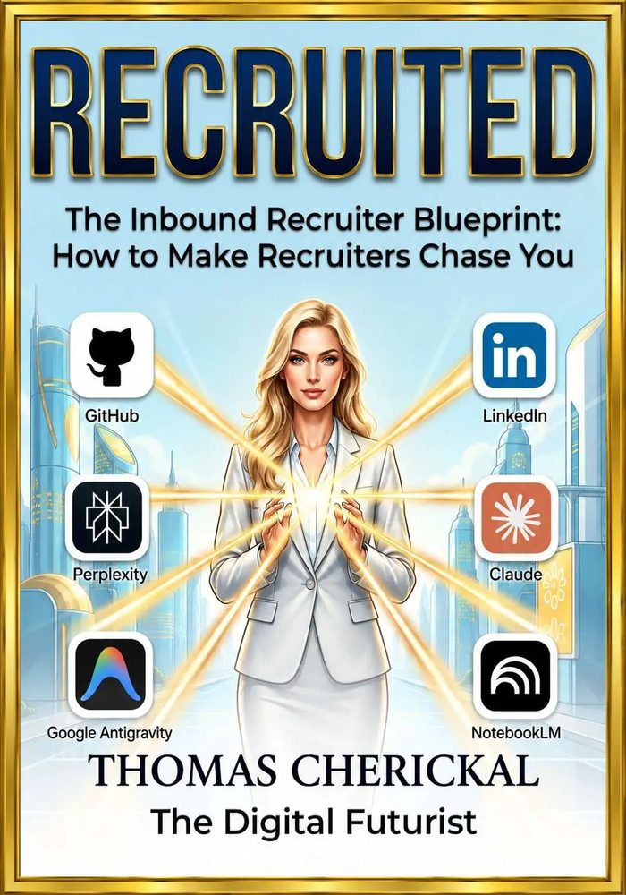

# Thomas Cherickal — Generative AI Consultant, Emerging Technologies Expert & AI Trainer

> `// The Digital Futurist · est. 2020 · chennai, india`

**Generative AI Consultant, Emerging Technologies Expert, Generative AI Trainer**  
*Premium 1:1 sessions available*

### Core Focus Areas
- `Generative AI Consultant`
- `Emerging Tech Expert`
- `Generative AI Trainer`
- `Agentic AI & Local LLMs`

---

## Bio
I architect frontier AI systems and deliver hands-on executive briefings and technical training. Leveraging state-of-the-art tools like Claude Code and Google Antigravity, I help leadership teams, engineers, and professionals master Generative AI, local LLM deployments, and custom agentic workflows.

### Quick Actions
- [🌐 Main Site](https://thomascherickal.com)
- [🐙 GitHub Profile](https://github.com/thomascherickal)
- [📅 Book 1:1 Consult](https://topmate.io/thomascherickal)
- [📧 Kit Newsletter](https://thomascherickal.kit.com)

---

## Key Metrics
| Metric | Value |
| :--- | :--- |
| **Articles Published** | 500+ |
| **Years in Tech** | 8+ |
| **Platforms** | 7+ |
| **GitHub Repos** | 2000+ |

---

## Roles & Capabilities

Empowering boards, executives, engineering teams, and professionals across Generative AI, Local LLM Consulting, and Emerging Tech Reviews.

### 🎓 Generative AI Training
Tiered, hands-on training programs for Board members, CXOs, Executive Leaders, Engineering Teams, and 1:1 Professionals. Master GenAI strategy, Claude Code, Copilot, Gemini workflows, and deployed agentic systems.

### ⚡ Local AI Consulting
Designing, deploying, and optimizing privacy-preserving Local LLMs & SLMs (LM Studio, Ollama, llama.cpp, Qwen, Gemma) on local hardware. Architecture reviews and strategy for migrating companies to AI.

### 🔮 Emerging Technology Reviews
Strategic briefings and deep technical evaluations on Quantum Computing, post-quantum crypto risk, AGI trajectory, ASI predictions, and action plans for surviving the AI-first world.

### 🏢 Generative AI Consultant
Delivering end-to-end AI transformation: process automation, website creation, custom AI app development, SEO/AEO/GEO strategy, and enterprise AI adoption roadmaps.

### 🤖 AI Mentor & Coach
Working 1-on-1 via Topmate with individuals and teams to accelerate adoption of frontier AI tools — prompt engineering, local LLM setup, agentic workflows, and AI career development.

### 🦀 Rust Systems Engineer
Building ultra-performant, memory-safe backend services, CLI tools, and async network applications using Rust, Cargo, Tokio, and WebAssembly.

### 🐍 Python AI/ML Engineer
Engineering frontier AI/ML pipelines, custom LLM agents, fine-tuning workflows, PyTorch/TensorFlow models, and high-performance FastAPI backends.

### 🐹 Go Cloud Engineer
Architecting cloud-native microservices, containerized infrastructure, high-throughput gRPC services, and Kubernetes systems with Golang.

### 🌐 HTML/CSS/JavaScript
Crafting responsive, high-performance web experiences, modern CSS glassmorphism design systems, and rich vanilla JavaScript applications.

### 🚀 Deployment
Deploying web applications, model demos, and automated workflows across GitHub Pages, Netlify, HuggingFace Spaces, and Kaggle.

### 🖥️ Website Creation
Designing, building, and deploying modern web solutions using WordPress, Wix, Framer, Google AI Studio, and SITE123.

---

## Tech Stack & Domains

- **⚙️ Languages**: Rust, Python, Golang
- **🤖 AI & ML**: Generative AI, Local LLMs, AI Agents, SLMs, Agentic AI Assistants, Prompt Engineering
- **🛠️ Local AI Stack**: LM Studio, Ollama, OpenRouter, llama.cpp
- **📚 Domains**: Quantum Computing, Blockchain, QAI, Cybersecurity, Algorithms, Metaheuristics
- **🧰 AI Tools**: Google AI Studio, Claude Code, Gemini Notebook, Google Gemini
- **🦀 Rust Systems Engineer**: Rust, Cargo, Memory Safety, Concurrency, Tokio / Async, WebAssembly
- **🐍 Python AI/ML Engineer**: PyTorch, TensorFlow, scikit-learn, HuggingFace, FastAPI, LangChain
- **🐹 Go Cloud Engineer**: Golang, Docker, Kubernetes, Microservices, gRPC, Cloud Native
- **🌐 HTML/CSS/JavaScript**: HTML5, CSS3, JavaScript, Responsive Design, DOM Manipulation, Web Performance
- **🚀 Deployment**: GitHub Pages, Netlify, HuggingFace Spaces, Kaggle, Vercel, CI/CD Workflows

---

## Featured Writing & Published Articles

Long-form technical content published on HackerNoon, Medium, Substack, Hashnode, LinkedIn, and more.

### 🤖 Generative AI, LLMs & Agents
1. [🥊 Google Gemini vs Anthropic Claude vs OpenAI ChatGPT vs xAI Grok: The Ultimate Comparison](https://hackernoon.com/google-gemini-vs-anthropic-claude-vs-openai-chatgpt-vs-xai-grok-the-ultimate-comparison)
2. [🏃 How to Run Your Own Local LLM — 2026 Edition](https://hackernoon.com/how-to-run-your-own-local-llm-2026-edition-version-1)
3. [🤖 The AI Agent Revolution: How to Build the Workforce of Tomorrow](https://hackernoon.com/the-ai-agent-revolution-how-to-build-the-workforce-of-tomorrow)
4. [💪 The Case for Local AI Has Never Been Stronger](https://hackernoon.com/the-case-for-local-ai-has-never-been-stronger)

### ⚛️ Quantum Computing & QAI
1. [🔬 Quantum Computing Fundamentals Part I: 10 Easy Pieces](https://hackernoon.com/quantum-computing-fundamentals-part-i-10-easy-pieces)
2. [⚗️ Quantum Computing Fundamentals Part II: 10 Not-So Easy Pieces](https://hackernoon.com/quantum-computing-fundamentals-part-ii-10-not-so-easy-pieces)
3. [⚖️ Comparing Quantum Frameworks: IBM Qiskit, Microsoft Q#, and Quantinuum's New Stack](https://hackernoon.com/comparing-quantum-programming-frameworks-ibm-qiskit-microsoft-q-and-quantinuums-new-stack)
4. [⚡ How Quantum Computers Threaten Bitcoin and the Entire Internet: Simply Explained](https://hackernoon.com/how-quantum-computers-threaten-bitcoin-and-the-entire-internet-simply-explained)

### 🔗 Blockchain
1. [💡 How Blockchain and Smart Contracts Revolutionize Content Monetization for Intellectual Property](https://hackernoon.com/how-blockchain-and-smart-contracts-revolutionize-content-monetization-for-intellectual-property)
2. [🏭 The Startup That Will Change the Industrial World: The Decentralized Autonomous Supply Chain](https://hackernoon.com/the-startup-that-will-change-the-industrial-world-the-decentralized-autonomous-supply-chain)
3. [🚀 7 Blockchain Startups That Could Generate Multibillion-Dollar Revenue Within 2 Years](https://hackernoon.com/7-blockchain-startups-that-could-generate-multibillion-dollar-revenue-within-2-years)
4. [⚔️ Classical Blockchain vs Hedera Hashgraph](https://hackernoon.com/classical-blockchain-vs-hedera-hashgraph)

### 🔮 Futurism & AGI
1. [🏁 Why the Race to AGI is Humanity's Defining Moment](https://hackernoon.com/why-the-race-to-agi-is-humanitys-defining-moment)
2. [🛡️ AI-Proof Your Career Future: The #1 Skill AI Agents Cannot Touch](https://hackernoon.com/ai-proof-your-career-future-the-1-skill-ai-agents-cannot-touch)
3. [🔴 Code Red: Why China Is Well Positioned to Win the AI Race](https://hackernoon.com/code-red-why-china-is-well-positioned-to-win-the-ai-race)
4. [💰 Small Language Models Have a Trillion-Dollar Future](https://hackernoon.com/small-language-models-have-a-trillion-dollar-future)

### 🦾 AI Agentic Assistants
1. [🦀 The OpenClaw Saga: How the Last Two Weeks Changed the Agentic AI World Forever](https://hackernoon.com/the-openclaw-saga-how-the-last-two-weeks-changed-the-agentic-ai-world-forever)
2. [OpenFang: The Game-Changing Open Source Agent OS That Replaces OpenClaw](https://hackernoon.com/openfangthe-game-changing-open-source-agent-operating-system-that-replaces-openclaw)
3. [⚔️ Hermes Agent vs OpenClaw: Which AI Agent Framework Wins in 2026?](https://hackernoon.com/hermes-agent-vs-openclaw-which-ai-agent-framework-wins-in-2026)
4. [💎 The Next Trillion-Dollar AI Shift: Why OpenClaw Changes Everything for LLMs](https://hackernoon.com/the-next-trillion-dollar-ai-shift-why-openclaw-changes-everything-for-llms)

### 🛠️ AI Tools & Productivity
1. [🏅 The AI Olympics: Which $20 AI Subscription Plan Wins in 2026?](https://hackernoon.com/the-ai-olympics-which-20-usd-ai-subscription-plan-wins-in-2026)
2. [📚 Introducing Code Wiki: Google's NotebookLM for Developers](https://hackernoon.com/introducing-code-wiki-googles-notebooklm-for-developers)
3. [💬 The Internet Can't Stop Talking About Google NotebookLM](https://hackernoon.com/the-internet-cant-stop-talking-about-google-notebooklm)
4. [🚀 Google Antigravity: 20 Game-Changing Prompts for Complete Automation](https://hackernoon.com/google-antigravity-20-game-changing-prompts-for-complete-automation)

#### More Writing Platforms
- [Read on HackerNoon →](https://hackernoon.com/u/thomascherickal)
- [Read on Medium →](https://thomascherickal.medium.com)
- [Subscribe on Substack →](https://thomascherickal.substack.com)

---

## Books & Long-Form

### RECRUITED — The AI-Powered Career Playbook for Professionals Who Refuse to Be Left Behind
*(Pre-Order Status)*

A comprehensive transformation system showing professionals how to use frontier AI tools — ChatGPT, Claude, Gemini, NotebookLM, Perplexity — to accelerate their job search, rebuild their brand, and land roles that actually match their ambition. Real frameworks. Real tools. Real results.

- [🎗 Pre-Order on Patreon](https://patreon.com/thomascherickal)

---

## Generative AI Training Tiers

Comprehensive AI training programs tailored for enterprise leadership, engineering teams, and individual professionals. Premium 1:1 sessions available.

### Tier 4 — Executive Horizon: Board & CXO Horizon Briefing
- **Format**: ⏱️ 2 Hours · Live & Remote · One Leadership Team
- Emerging Tech Horizon Briefing & AI-First strategy
- Quantum Computing & post-quantum crypto risk assessment
- AGI trajectory & ASI predictions roadmap
- How to Survive & Thrive in the AI-first world

### Tier 3 — Leadership: Executive AI Programme
- **Format**: ⏱️ 2 Hours · Live & Remote · 8–10 Leaders
- GenAI strategy & executive leadership alignment
- Hands-on Copilot, Claude Pro & Gemini apps
- Ends in a deployed live workflow per participant
- Practical AI tools governance & ROI tracking

### Tier 2 — Engineering: Engineering Team Training
- **Format**: ⏱️ 2 Hours · Live & Remote · Engineering Teams
- Agentic AI development & multi-agent architectures
- Local LLM deployment (Ollama, LM Studio, llama.cpp)
- Claude Code terminal integration & TDD workflows
- AI-assisted coding & testing workflows

### Tier 1 — Individual 1:1: Mentoring & Coaching
- **Format**: ⏱️ 2 Hours · Live 1-on-1 · Via Topmate
- Personalized Generative AI & SLM/LLM training
- Claude Code & AI-assisted development setup
- Local LLM configuration on your hardware
- Direct 1-on-1 Q&A and hands-on guidance

---

## Collaboration Services

- **✍️ Technical Writing**: Long-form articles, tutorials, developer guides, and whitepapers. HackerNoon-grade depth.
- **🏢 AI Consulting**: AI strategy, Local LLM implementation, AI agentic tools, and enterprise AI transformation.
- **🌐 Website Development**: Custom website design and deployment across major platforms, with SEO, AEO, and GEO built in from the ground up.
- **👤 AI Upskilling · Individuals**: 1-on-1 mentoring to master frontier AI tools, build a personal AI stack, and accelerate your career.
- **🏋️ AI Mentoring · All Levels**: From complete beginners to senior engineers — structured mentoring to unlock real AI productivity.
- **💼 Executive Briefings**: Custom briefings for Boards, CXOs, and leadership teams on AGI, Quantum risk, and AI migration.

### Online Sales & Digital Products
- [🗓️ 1-on-1 Consults — topmate.io/thomascherickal](https://topmate.io/thomascherickal)
- [🛒 Digital Products & Playbooks — thomascherickal.gumroad.com](https://thomascherickal.gumroad.com)
- [🎗 Exclusive Member Content — patreon.com/thomascherickal](https://patreon.com/thomascherickal)
- [💼 LinkedIn Profile — linkedin.com/in/thomascherickal](https://linkedin.com/in/thomascherickal)

---

## Contact & Location

- **Email**: [thomascherickal@gmail.com](mailto:thomascherickal@gmail.com)
- **Location**: Chennai, India · Remote Worldwide

---

## Newsletter & Social Links

### 📧 The Digital Futurist Newsletter
How to understand and build emerging technologies.  
[Subscribe Free →](https://thomascherickal.kit.com)

### Find Me Online
- [🌐 Profile (thomascherickal.com)](https://thomascherickal.com)
- [🐙 GitHub (github.com/thomascherickal)](https://github.com/thomascherickal)
- [💼 LinkedIn (in/thomascherickal)](https://linkedin.com/in/thomascherickal)
- [🦊 GitLab (gitlab.com/thomascherickal)](https://gitlab.com/thomascherickal)
- [☁️ Azure DevOps (dev.azure.com/thomascherickal)](https://dev.azure.com/thomascherickal)
- [🗞 HackerNoon (u/thomascherickal)](https://hackernoon.com/u/thomascherickal)
- [✍️ Medium (@thomascherickal)](https://thomascherickal.medium.com)
- [🔷 Hashnode (thomascherickal.hashnode.dev)](https://thomascherickal.hashnode.dev)
- [📬 Substack (thesingularitypoint.substack.com)](https://thesingularitypoint.substack.com)
- [💻 DEV Community (dev.to/thomascherickal)](https://dev.to/thomascherickal)
- [❓ Quora (thomascherickal.quora.com)](https://thomascherickal.quora.com)
- [🤖 Reddit (reddit.com/user/thomascherickal)](https://reddit.com/user/thomascherickal)
- [📊 Kaggle (kaggle.com/thomascherickal)](https://www.kaggle.com/thomascherickal)
- [🏅 CodersRank (profile.codersrank.io/user/thomascherickal)](https://profile.codersrank.io/user/thomascherickal/)
- [🤓 Geek4Geeks (geeksforgeeks.org/profile/thomascherickal)](https://www.geeksforgeeks.org/profile/thomascherickal)
- [📄 HubPages (hubpages.com/@thomascherickal)](https://hubpages.com/@thomascherickal)
- [🧠 Deep-ML (deep-ml.com/profile/thomascherickal)](https://www.deep-ml.com/profile/thomascherickal)
- [🏆 HackerRank (hackerrank.com/profile/thomascherickal)](https://hackerrank.com/profile/thomascherickal)
- [💡 LeetCode (leetcode.com/u/thomascherickal)](https://leetcode.com/u/thomascherickal)
- [🔗 Linktree (linktr.ee/thomascherickal)](https://linktr.ee/thomascherickal)
- [🎗 Patreon (patreon.com/thomascherickal)](https://patreon.com/thomascherickal)
- [🛒 Gumroad (thomascherickal.gumroad.com)](https://thomascherickal.gumroad.com)
- [📅 Topmate (topmate.io/thomascherickal)](https://topmate.io/thomascherickal)

---
*© 2026 Thomas Cherickal · The Digital Futurist · Generative AI Consultant & Executive AI Trainer*  
*📍 Chennai, India 🇮🇳 · Built with GitHub Pages*
