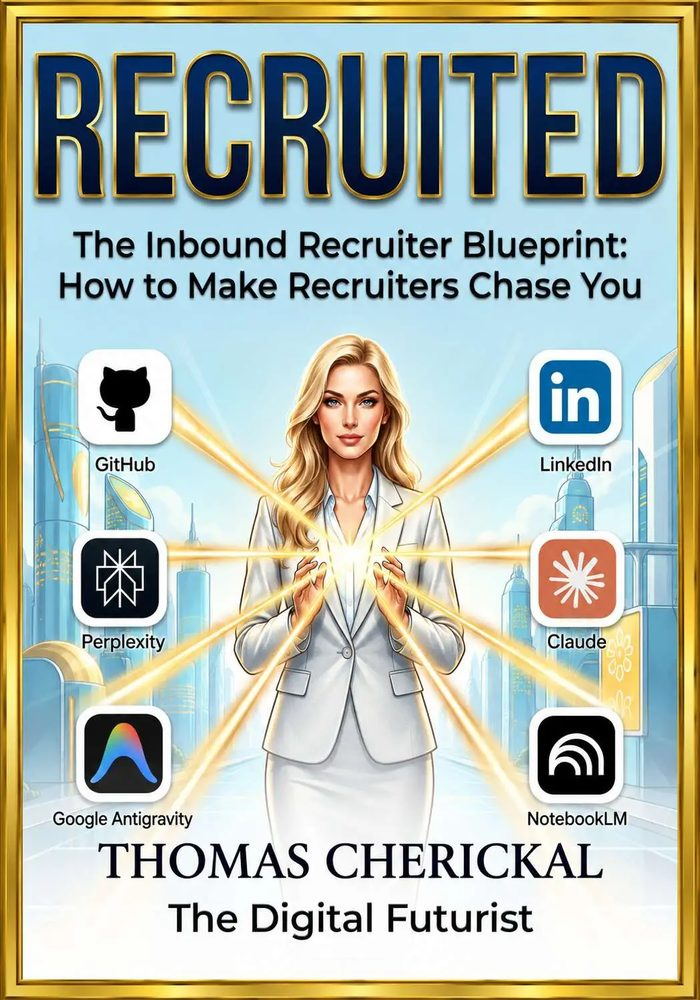

# Thomas Cherickal
## Technical Writer · Generative AI Consultant · Quantum Systems Explorer · Python AI Engineer · Rust Systems Engineer

> **I author high-impact content, and create high-impact code for Generative AI, AI Agents, Python, Rust, and other technologies.**

**Location**: Chennai, India (Remote — Worldwide)  
**Brand**: The Digital Futurist  
**Email**: [thomascherickal@gmail.com](mailto:thomascherickal@gmail.com)  

**Core Capabilities**:
- `Technical Writer`
- `Python AI Engineer`
- `Rust Systems Engineer`
- `Generative AI Consultant`
- `Quantum Systems Explorer`
- `Code-First Runtime-Verified Artifacts`
- `AI Agent Orchestration & Architectures`

---

## Bio
PG in CS from Loyola College; Technical Writer, Generative AI Consultant, Quantum Systems Explorer, Python AI Engineer, and Rust Systems Engineer. 500+ published technical deep dives across 10+ platforms since 2020. I specialize in technical consulting, Python and Rust development, and architecting comprehensive code-first high-impact code across Python, Rust, Google Cloud Platform, SLMs, LLMs, Multimodality, Local LLMs, AI Agents, Quantum Systems, Research Engineering, AI Workflows, and other tools, frameworks, systems, and applications.

### Workflow & Methodology: Research → Build → Run → Verify → Explain
**AI accelerates the workflow. Human verification owns the result.**
1. **Research and source discovery**: Primary arXiv papers, documentation archives, hardware specifications.
2. **Structural drafting**: Pedagogical structure, outline stress-testing, modular architecture.
3. **Executable implementation**: Code-first artifacts in Python, Rust, and Qiskit built for production environments and developer adoption.
4. **Runtime verification**: Live sandbox execution, test suites (`pytest`, `cargo test`), and quantum simulators/hardware.
5. **Human technical/editorial judgment**: Single-point intellectual accountability, domain precision, and authoritative code review.

### Quick Actions
- [🌐 Main Site](https://thomascherickal.com)
- [📚 Business Site](https://thomascherickal.github.io/)
- [🐙 GitHub Profile](https://github.com/thomascherickal)
- [📅 Book 1:1 Consult](https://topmate.io/thomascherickal)

---

## Key Metrics
| Metric | Value |
| :--- | :--- |
| **Publications** | 500+ |
| **Platforms** | 10+ |
| **Niche Audience Reach** | 250,000+ |
| **Featured Deep Dives** | 48 |

---

## Core Capabilities & Specialized Roles (10 Areas)

1. **Python AI Systems & Code Verification**: Executable PyTorch pipelines, Hugging Face Transformers, FastAPI backends, and agent runtimes with code-first, runtime-verified code.
2. **Rust Systems & Performance Engineering**: Tokio async architectures, Burn/Candle ML tutorials, high-throughput systems, and performance benchmarks with verified Rust crates.
3. **AI Agent Orchestration (Architecture & Guides)**: Multi-agent systems, tool-calling loops, agent swarms, and persistent workflows (LangGraph, CrewAI, AutoGen, OpenClaw, Hermes Agent).
4. **Quantum Computing & QML (Architecture & SDKs)**: Hands-on IBM Qiskit, PennyLane, variational circuits, and quantum algorithms (Grover, Shor, VQE, QAOA) for developers and engineers.
5. **LLM & Agent Systems (Documentation & Evaluation)**: RAG pipelines, agentic workflows, prompt engineering frameworks, and evaluation benchmarks.
6. **Post-Quantum Cryptography & Quantum Risk (Consulting & Architecture)**: PQC transition roadmaps, NIST standard migrations (ML-KEM / ML-DSA), and enterprise risk assessments.
7. **Local & Private AI (Deployment Guides & Benchmarks)**: Ollama, LM Studio, llama.cpp, GGUF quantization, and private SLM deployment tutorials.
8. **Model Engineering (Fine-Tuning & Alignment)**: Supervised fine-tuning (SFT), parameter-efficient adaptations (LoRA, QLoRA), direct preference optimization (DPO, GRPO), and production model customization (Unsloth, Hugging Face TRL, PEFT, DeepSpeed).
9. **Systems Architecture & Technical Consulting**: Custom technical roadmaps, architectural reviews, structured technical documentation, and hands-on Jupyter notebook modules.
10. **LLM Evaluation & Safety Guardrails**: Automated evaluation harnesses, hallucination benchmarks, unit-test suites for RAG and agentic workflows, deterministic safety guardrails, and production evaluation observability (Ragas, DeepEval, NeMo Guardrails, Langfuse, Promptfoo).

---

## Tech Stack & Tooling

- **💻 Languages (Code-First Systems)**: Python, Rust, SQL, TypeScript, JavaScript, Bash
- **🧠 Generative AI Systems**: LLMs, SLMs, Agentic AI, RAG, Vector Databases, Systems Architecture & Coding
- **🐍 Python AI Ecosystem**: PyTorch, Transformers, HuggingFace, FastAPI, LangGraph, Pydantic, Pytest
- **🦀 Rust Systems Ecosystem**: Tokio, Actix, Axum, Candle, Burn, Rayon, Cargo Test Suite
- **🎯 Model Engineering**: LoRA / QLoRA, Unsloth, PEFT, Hugging Face TRL, DPO / GRPO
- **📊 LLM Evaluation**: Ragas, DeepEval, NeMo Guardrails, Langfuse, Promptfoo
- **⚛️ Quantum Systems**: IBM Qiskit, PennyLane, Quantum Machine Learning, Quantum Algorithms, Microsoft Q# / Quantinuum
- **🤖 AI Tools Expertise**: Claude Code, Google Antigravity, Google AI Studio, Gemini Notebook, CodeWiki
- **⚡ Local & Private AI Stack**: Ollama, LM Studio, llama.cpp, GGUF, LanceDB, HuggingFace Hub
- **🔬 Verification & Execution**: Jupyter, pytest, cargo test, Qiskit Aer Simulator, Docker Sandboxes, Google Cloud Platform
- **🗄️ Databases & Vector Stores**: Vector Databases, pgvector, Qdrant, LanceDB, SQL, MySQL, SQLite
- **📐 Documentation & Deliverables**: Markdown/MDX, OpenAPI / Swagger JSON Specs, Jupyter Notebooks (`.ipynb`), Live Repositories
- **🛡️ Editorial & Engineering Standards**: Human Direction, Code-First Runtime Verification, Primary Source Research, Responsible AI Use

---

## How This Actually Gets Made — AI-Assisted, Human-Directed, Runtime-Verified

I use frontier AI tools for research, synthesis, exploration, ideation, and editorial acceleration — while applying human judgment, technical expertise, and independent verification to the final work. Credibility comes from expertise, evidence, judgment, and verification — not from whether a particular sentence was typed by a human or generated with AI assistance.

### 1. Research
1. Primary arXiv research papers, preprints, and academic conference publications
2. Official hardware architecture specifications, whitepapers, and engineering manuals
3. Direct inspection of SDK codebases, official documentation, and API changelogs
4. Reproducible benchmark suites, datasets, and historical performance metrics

### 2. AI-Assisted Exploration
1. Rapid literature discovery, paper synthesis, and documentation cross-referencing
2. Exploring code patterns, API surfaces, and architectural alternatives
3. Brainstorming pedagogical structures and alternative explanatory analogies
4. Stress-testing outlines and identifying technical questions worth investigating

### 3. Human Direction
1. Strategic topic selection, conceptual framing, and audience calibration
2. Technical judgment and architectural nuance that AI tools cannot provide
3. Critical skepticism, fact-checking, and narrative prioritization
4. Domain intuition built across 500+ published technical deep dives
5. Single-point intellectual responsibility for every deliverable

### 4. Verification
1. Executing Python and Rust code in isolated sandbox environments
2. Testing quantum circuits in Qiskit Aer simulators or on real IBM Quantum hardware
3. Validating REST, gRPC, and WebSocket endpoints against live servers
4. Tracing comparative benchmark claims directly to verifiable primary sources
5. Unit-testing and linting with `pytest`, `cargo test`, and containerized CI suites

---

## Featured Case Studies (Portfolio Highlights)

1. [⚛️ Comparing Quantum Programming Frameworks](https://hackernoon.com/comparing-quantum-programming-frameworks-ibm-qiskit-microsoft-q-and-quantinuums-new-stack) — Comparative analysis of IBM Qiskit, Microsoft Q#, and Quantinuum. *(Published: Sep 15, 2025 · 3,500 words)*
2. [⚛️ Quantum Computing Fundamentals Part I](https://hackernoon.com/quantum-computing-fundamentals-part-i-10-easy-pieces) — Technical guide for senior engineers transitioning to quantum computing. *(Published: Dec 29, 2025 · 4,200 words)*
3. [⚛️ Quantum Computing Fundamentals Part II](https://hackernoon.com/quantum-computing-fundamentals-part-ii-10-not-so-easy-pieces) — Advanced guide to QFT, phase estimation, and multi-qubit entanglement. *(Published: Dec 31, 2025 · 4,500 words)*
4. [⚛️ How Quantum Computers Threaten Bitcoin](https://hackernoon.com/how-quantum-computers-threaten-bitcoin-and-the-entire-internet-simply-explained) — Post-quantum cryptography threat analysis and NIST candidate standards. *(Published: Dec 7, 2025 · 3,200 words)*
5. [🧠 Running Local LLMs Guide](https://hackernoon.com/how-to-run-your-own-local-llm-2026-edition-version-1) — Technical deployment guide across Ollama, LM Studio, llama.cpp, and GGUF quantization. *(Published: Mar 9, 2026 · 3,800 words)*
6. [🧠 Ultimate LLM Benchmark Comparison](https://hackernoon.com/google-gemini-vs-anthropic-claude-vs-openai-chatgpt-vs-xai-grok-the-ultimate-comparison) — Comparative benchmark analysis of Gemini, Claude, ChatGPT, and Grok. *(Published: Mar 12, 2026 · 5,000 words)*
7. [🧠 The Hidden Geometry of Generative AI](https://thomascherickal.com/2026/07/15/the-hidden-geometry-of-generative-ai-how-manifold-theory-explains-the-mysteries-nobody-explained-to-you/) — Solving 7 mysteries of deep learning via differential geometry and manifold theory. *(Published: Jul 15, 2026 · 9,100 words)*
8. [🧠 Nobody Knows How LLMs Work Unless You Look as Dynamical Systems](https://thomascherickal.com/2026/07/31/nobody-knows-how-llms-work-unless-you-look-at-them-as-non-linear-dynamical-systems/) — Mathematical analysis of emergence, grokking, and attractor dynamics in transformers. *(Published: Jul 31, 2026 · 4,500 words)*
9. [🦾 The OpenClaw Saga](https://hackernoon.com/the-openclaw-saga-how-the-last-two-weeks-changed-the-agentic-ai-world-forever) — Fast-turnaround ecosystem deep dive into open-source multi-agent frameworks. *(Published: Mar 2, 2026 · 3,600 words)*
10. [🦾 Hermes Agent vs OpenClaw](https://hackernoon.com/hermes-agent-vs-openclaw-which-ai-agent-framework-wins-in-2026) — Comparative architecture study of state graphs, GRPO RL, and multi-step reasoning loops. *(Published: May 13, 2026 · 4,000 words)*

---

## Books & Long-Form

### RECRUITED — The Inbound Recruiter Blueprint: How to Make Recruiters Chase You
*(Pre-Order Status — $20.00 USD pre-release until December 31, 2026 ($40.00 USD after release) · Free with an active Patreon subscription)*

A comprehensive transformation system showing professionals how to use frontier AI tools — GitHub, LinkedIn, Perplexity, Claude, Google Antigravity, and Gemini Notebook — to rebuild their professional presence so that inbound recruiter offers find them.

- [🎗 Pre-Order on Patreon](https://patreon.com/thomascherickal)

---

## Service Offerings (5 Offerings)

1. **AI Agent Orchestration (Consulting & Code)**: Architectural consulting and technical guides on multi-agent systems, tool-calling loops, agent swarms, and production agentic workflows. Multi-agent swarms and tool loops runtime-verified in live environments before delivery.
2. **Technical Deep Dives (Code-First Content)**: Commissioned long-form explainers (2,000–8,000 words) across Generative AI architectures and Quantum Systems with original research and verified runnable implementations in Python and Rust.
3. **Local LLM Deployment (Consulting & Guides)**: Deployment walkthroughs, vLLM and Ollama setup guides, GGUF optimization, and private enterprise LLM serving documentation. Quantization and serving blueprints verified on live GPU and local hardware runtimes.
4. **Generative AI Developer Content & Code (Python & Rust)**: Production RAG pipelines, agentic workflows, fine-tuning guides, and automated developer documentation for frontier GenAI products. Code logic and systems runtime-verified in Python and Rust.
5. **Monthly Content & Code Retainer**: Dedicated monthly sprint capacity for devtools and AI infrastructure companies, providing guaranteed technical volume with mandatory code execution checks.

---

## Strategic Collaboration & Engagement Models

Structured collaboration frameworks for Generative AI toolmakers, quantum SDK vendors, devtool creators, and enterprise engineering teams.

### 9 Ways We Can Work Together

1. **Systems Architecture Consulting & Content Verification**: Deep architectural reviews, Generative AI agent swarm design, Post-Quantum migration blueprints, runtime benchmark verification, and containerized sandbox testing.
2. **Developer Tutorials & Codebases**: Structured developer onboarding paths, multi-part deep-dive tutorial series, and production reference codebases in Python and Rust to accelerate developer adoption and nurture ecosystems.
3. **Content Partnerships & Retainers**: Dedicated monthly sprint capacity delivering continuous technical thought leadership, release coverage, and architectural guides with async Slack/Discord collaboration.
4. **Technical Content Strategy**: Developer journey mapping, competitive benchmarking, and quarterly technical publication roadmaps.
5. **Editorial Workflows & Verification CI**: Consulting engineering and content teams on AI-native workflows, automated code snippet verification pipelines (GitHub Actions), syntax/runtime testing harnesses, and style guides.
6. **High-Authority Guest Publications**: In-depth research-grounded articles (2,500–5,000 words), custom Mermaid diagrams, and verified code repositories under authentic byline for corporate engineering blogs or industry publications.
7. **Joint Technical Collaboration**: Co-authored engineering investigations, architectural teardowns, reproducible benchmarks, and joint case studies cross-promoted across developer ecosystems.
8. **Sponsored Deep Dives in Newsletter**: Dedicated feature issues (2,000+ words), sponsored architectural breakdowns, and curated technical spotlights in *The Digital Futurist*.
9. **Open Source Documentation & Starter Repositories**: Production-grade documentation ecosystems, comprehensive API references, runnable quickstarts, and contributor onboarding docs for open-source frameworks and SDKs.

### Editorial Integrity Standard

- **100% Authentic Bylines (No Ghostwriting)**: All commissioned write-ups, deep dives, tutorials, and benchmarks carry my authentic domain-expert byline; ghostwritten marketing pieces are never accepted, preserving developer credibility and trust.

### 8-Step Collaboration Lifecycle

1. **Scope & Technical Briefing**: Aligning on engineering objectives, audience depth, and deliverables via an async intake brief or scoping call.
2. **Milestone Agreement**: Transparent project proposal with clearly defined scope and milestone deliverables.
3. **Primary Research & Architecture**: AI-accelerated literature synthesis, outline review, architectural schematics, and code specification alignment.
4. **Live Sandbox Code Verification**: Testing all code samples in live Python REPLs, `pytest`, `cargo test` sandboxes, or Qiskit simulators with real execution output logs.
5. **Unlimited Revisions**: Continuous, collaborative iteration on drafts, diagrams, and repositories until engineering leadership is fully satisfied.
6. **Milestone Sign-Off & IP Transfer**: Full commercial publication rights and clean repository handover granted upon milestone sign-off with authentic author attribution.
7. **Multi-Platform Launch & Distribution**: Coordinated release and active cross-promotion across developer networks, Substack (*The Digital Futurist*), HackerNoon, and LinkedIn.
8. **60-Day Free Modifications**: Post-launch support including minor code patches, upstream SDK breaking-change updates, and ongoing technical maintenance.

### Who I Collaborate With

- **GenAI & LLM Toolmakers**: RAG infrastructure, agentic frameworks, fine-tuning platforms, and vector database teams.
- **Quantum SDK & Hardware Vendors**: Quantum computing platforms, QML framework developers, and post-quantum security providers.
- **AI Infrastructure & Compute Platforms**: GPU clouds, model serving engines (vLLM, Ollama), and inference acceleration runtimes.
- **Enterprise Engineering & Systems Teams**: Organizations implementing private enterprise LLMs, PQC migrations, or high-performance Rust systems.
- **Technical Publications & Open Source Communities**: Developer platforms, open research teams, academic initiatives, and devtool startups.

---

## Contact & Location

- **Email**: [thomascherickal@gmail.com](mailto:thomascherickal@gmail.com)
- **Location**: Chennai, Tamil Nadu, India 🇮🇳 (Remote Worldwide)
- **Direct Consults**: [Book via Topmate](https://topmate.io/thomascherickal)

---

## Links

### Find Me Online
- [🌐 Profile (thomascherickal.com)](https://thomascherickal.com)
- [🐙 GitHub (github.com/thomascherickal)](https://github.com/thomascherickal)
- [💼 LinkedIn (in/thomascherickal)](https://linkedin.com/in/thomascherickal)
- [🗞 HackerNoon (u/thomascherickal)](https://hackernoon.com/u/thomascherickal)
- [✍️ Medium (@thomascherickal)](https://thomascherickal.medium.com)
- [🔷 Hashnode (thomascherickal.hashnode.dev)](https://thomascherickal.hashnode.dev)
- [📬 Substack (thesingularitypoint.substack.com)](https://thesingularitypoint.substack.com)
- [🟧 Blogger (thesingularitypoint.blogspot.com)](https://thesingularitypoint.blogspot.com/)
- [❓ Quora (thomascherickal.quora.com)](https://thomascherickal.quora.com)
- [🤖 Reddit (reddit.com/user/thomascherickal1)](https://reddit.com/user/thomascherickal1)
- [🧪 Exercism (exercism.org/profiles/thomascherickal)](https://exercism.org/profiles/thomascherickal)
- [🏅 CodersRank (profile.codersrank.io/user/thomascherickal)](https://profile.codersrank.io/user/thomascherickal/)
- [🧠 Deep-ML (deep-ml.com/profile/thomascherickal)](https://www.deep-ml.com/profile/thomascherickal)
- [✖️ X (@thomazcherickal)](https://x.com/thomazcherickal)
- [👩‍💻 DEV (dev.to/thomascherickal)](https://dev.to/thomascherickal)
- [🦊 GitLab (gitlab.com/thomascherickal)](https://gitlab.com/thomascherickal)
- [✉️ Kit (thomascherickal.kit.com)](https://thomascherickal.kit.com)
- [🔗 Linktree (linktr.ee/thomascherickal)](https://linktr.ee/thomascherickal)
- [🎨 Patreon (patreon.com/thomascherickal)](https://patreon.com/thomascherickal)
- [🤝 Topmate (topmate.io/thomascherickal)](https://topmate.io/thomascherickal)

---
*© 2026 Thomas Cherickal · The Digital Futurist · Generative AI Consultant · Quantum Systems Explorer · Python AI Engineer · Rust Systems Engineer · Technical Writer*
